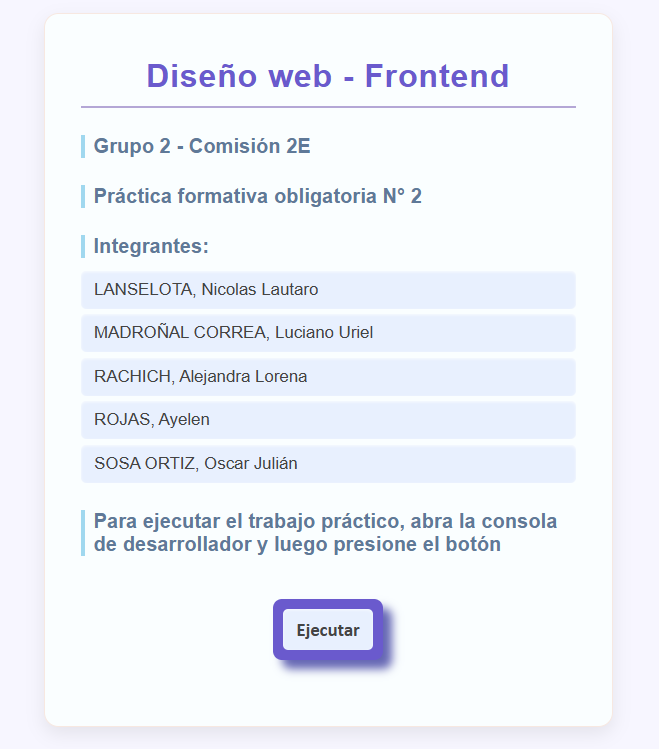

# Ejercicios de JavaScript – Funciones, strings, arrays y objetos

Este repositorio contiene una serie de ejercicios en JavaScript desarrollados
como práctica. Cada ejercicio está comentado, explicando la lógica utilizada
para resolverlo.
La página desplegada puede verse en 
https://alexa-2k.github.io/FrontEnd_PFO2-JS/

---

## Ejercicio 1 – Calcular el área de un rectángulo

Se propone resolver el cálculo del área de un rectángulo con una **función
flecha**, por ser un caso simple.  
El cálculo consiste en multiplicar base por altura.  
La función retorna el valor y no imprime por consola: _console.log()_ se utiliza
_fuera de la función_.

## Ejercicio 2a – Contar palabras (versión incorrecta)

La lógica utilizada consistió en contar los espacios y sumar 1 a ese conteo, ya
que el número de palabras en una frase es igual al número de espacios más uno.  
Este razonamiento funciona mientras el usuario no introduzca espacios dobles o
espacios al inicio o al final de la frase  
En la variable sentence usamos el método _split()_, que divide la frase en un
arreglo de palabras, con un caracter establecido como delimitador (en este caso,
el espacio) pero si el usuario introduce espacios dobles, el resultado no es el
esperado.  
Por eso propusimos la solución 2b.

## Ejercicio 2b – Contar palabras (corregido)

Investigamos los métodos _trim()_ y _split()_ con expresiones regulares.  
Se utiliza _trim()_ para eliminar espacios al inicio y al final, y agregando la
expresión regular _/\s+/_ a _split()_ eliminamos los espacios múltiples.  
Esto permite contar las palabras correctamente.  
El código se podría ajustar aún más, teniendo en cuenta la posibilidad de que el
usuario ingresase signos de puntuación precedidos por espacios, o sólo espacios,
por ejemplo, pero entendemos que no es el espíritu del ejercicio.

## Ejercicio 3 – Contar vocales

En principio pensamos en un _if()_ que verificara si el carácter era alguna de
las vocales. Pero si tomábamos la posibilidad de que el usuario ingresase
mayúsculas y vocales con tildes -tanto minúsculas como mayúsculas- las
condiciones de evaluación para el _if()_ serían demasiado extensas.  
Por eso decidimos armar una variable que reuniese todas las posibilidades, y
usamos _includes()_ para la comparación, en lugar de un _if()_.  
La función recorre la cadena carácter por carácter y verifica si el mismo
pertenece al conjunto de vocales.  
Cada coincidencia suma al contador.

## Ejercicio 4 – Verificar si es palíndromo

Aplicamos un prompt para solicitar al usuario que ingrese una palabra o
número.  
El string se pasa a minúsculas y se eliminan espacios, para que no se afecte el
resultado.  
Luego se invierte la cadena ingresada y se compara con la original.  
Si son iguales, la cadena ingresada es un palíndromo.  
Con el bucle _for()_ se repite el ejercicio 3 veces.

## Ejercicio 5 – Calcular edad de un perro en años humanos

Aplicamos un prompt para que se solicite al usuario el ingreso de la edad del
perro.  
 Se Multiplica la edad por 7, como indica la fórmula para edad canina.  
 El bucle _for()_ hace que el ejercicio se repita 3 veces.

## Ejercicio 6 – Iniciar palabras con mayúscula

En este ejercicio agregamos la lógica para el caso en el que el usuario no
ingrese nada, o ingrese sólo espacios.  
 Una vez que el usuario ingresa datos válidos, comienza la lógica solicitada:

1.  Pasamos a minúsculas todas las palabras y convertimos la frase en un array
    de palabras.
2.  Recorremos el array de palabras y convertimos la primera letra de cada
    palabra en mayúscula.
3.  Concatenamos la primera letra en mayúscula con el resto de la palabra que ya
    está en minúsculas.
4.  Devolvemos la frase con las palabras inicializadas en mayúsculas.

En este caso no controlamos espacios dobles para no complicar la lógica, ya que
no se solicita en el ejercicio.

## Ejercicio 7 – Sucesión de Fibonacci (iterativo)

Este ejercicio se puede resolver con un bucle como en esta primera solución, o
aplicando recursividad, como lo haremos en la segunda solución.  
 La secuencia de Fibonacci se inicia en 0 y 1, y continúa sumando los dos términos
anteriores para formar el actual.  
 Así, se forma 0, 1, 1 (0+1) , 2 (1+1), 3 (1+2), 5 (2+3), etc.  
 Siguiendo esa lógica construimos el bucle for, lo recorremos hasta el número de
términos solicitados por el usuario, y vamos almacenando los términos en un arreglo
llamado **result[]**.  
 En el caso de que el usuario indique cero o un número negativo, se devuelve el
arreglo vacío.

## Ejercicio 7 – Sucesión de Fibonacci (recursivo)

Esta segunda solución implementa _recursividad_ para calcular los términos de
Fibonacci.  
 La función se llama a sí misma con los dos términos anteriores hasta alcanzar los
casos base.  
 Luego, se construye la secuencia repitiendo este cálculo en un bucle hasta
completar la cantidad de términos deseados.

## Ejercicio 8 – Productos

Este ejercicio presenta un arreglo de productos, y con distintos métodos
mostramos información útil:

1.  **forEach()**: muestra cada producto con su nombre y precio
2.  **map()**: genera un array con solo los nombres
3.  **filter()**: obtiene los productos electrónicos con stock mayor a 20
4.  **find()**: busca un producto por ID
5.  **reduce()**: calcula el valor total del inventario (precio \* stock)

## Ejercicio 9 – Estudiantes

Se trabaja con un arreglo de estudiantes que incluye nombre, edad y un arreglo
de calificaciones:

1.  **foreach()**: muestra nombre y edad
2.  **map()**: calcula el promedio por estudiante
3.  **filter()**: selecciona aquellos con promedio mayor a 7.5
4.  **find()**: busca un estudiante específico por nombre
5.  **reduce()**: calcula la edad promedio del grupo

## Ejercicio 10 – Películas

Utilizamos un arreglo de películas y aplicamos:

1.  **foreach()**: muestra título y año
2.  **map()**: convierte títulos a mayúsculas
3.  **filter()**: selecciona dramas con rating mayor a 8.5
4.  **find()**: encuentra una película por el año de lanzamiento
5.  **reduce()**: suma la duración total de todas las películas

# Inicio
En la pantalla de inicio, abra la consola de desarrollador, y presione el botón "Ejecutar"

